    <h1>-SOFTWARE ARCHITECTURE-</h1>
    
¡Bienvenidos! En esta presentación, exploraremos en detalle los conceptos fundamentales de la arquitectura de software y las implicaciones que esto conlleva, por lo que tomará un buen tiempo abarcar y entender estos temas.

    <h2 align="center">Índice</h2>
    <ul>
        <li>...</li>
    </ul>  

    <h2 align="center">1. ¿Qué es la Arquitectura de Software?</h2>
    
No existe una única definición de arquitectura de software debido a su naturaleza multifacética y a la evolución constante de la industria del software. Diversos expertos y profesionales pueden ofrecer definiciones ligeramente diferentes basadas en sus perspectivas y necesidades específicas. Además, la arquitectura de software puede variar considerablemente según el tipo de aplicación o sistema que se esté desarrollando, lo que también contribuye a la falta de una única definición.

    <h2 align="center">2. Patrones de Diseño</h2>
    
Los patrones de diseño son soluciones comunes para problemas que surgen repetidamente en el diseño de software. Los puedes considerar como plantillas personalizables que te ayudan a resolver problemas de diseño recurrentes en tu código.

Es importante entender que no puedes simplemente copiar y pegar un patrón en tu programa como lo harías con funciones o bibliotecas predefinidas. Un patrón no es una pieza de código específica, sino más bien un enfoque general para abordar un problema particular. Debes adaptar los detalles del patrón e implementar una solución que se ajuste a las necesidades de tu propio programa.

A veces, los patrones se confunden con algoritmos, ya que ambos representan soluciones comunes para problemas conocidos. Sin embargo, hay una diferencia fundamental. Mientras que un algoritmo proporciona una secuencia de pasos claros para lograr un objetivo específico, un patrón es una descripción de nivel superior de una solución. Esto significa que el código que implementa el mismo patrón en dos programas diferentes puede ser distinto.

Para ilustrar esta diferencia, podríamos comparar un algoritmo con una receta de cocina, ya que ambos siguen pasos específicos para alcanzar un resultado deseado. Por otro lado, un patrón es más similar a un plano arquitectónico, donde puedes ver cómo debería ser el resultado final y cuáles son las funciones clave, pero la implementación exacta depende de ti y de las necesidades de tu proyecto.

<h3>2.1 ¿En qué consisten los Patrones de Diseño?</h3>

La mayoría de los patrones se describe con mucha formalidad para que la gente pueda reproducirlos en muchos contextos. Aquí tienes las secciones que suelen estar presentes en la de- scripción de un patrón:

- El propósito del patrón explica brevemente el problema y la solución.
- La motivación explica en más detalle el problema y la solución que brinda el patrón.
- La estructura de las clases muestra cada una de las partes del patrón y el modo en que se relacionan.
- El ejemplo de código en uno de los lenguajes de programación populares facilita la asimilación de la idea que se esconde tras el patrón.

Algunos catálogos de patrones enumeran otros detalles útiles, como la aplicabilidad del patrón, los pasos de implementación y las relaciones con otros patrones.

<h3>2.2 Ejemplos de Patrones de Diseño</h3>

- Patrón Singleton: Este patrón garantiza que una clase solo tenga una instancia.
- Patrón Factory: Este patrón proporciona una forma de crear objetos sin exponer la lógica de creación.
- Patrón Adaptador: Este patrón permite que dos objetos que no son compatibles interactúen entre sí.

    <h2 align="center">3. Patrones Arquitectónicos</h2>
    
Un patrón arquitectónico es una solución a un problema recurrente en el diseño de software. Es un esquema de organización estructural que define subsistemas, sus responsabilidades e interrelaciones. Los patrones arquitectónicos proporcionan una visión general de alto nivel de un sistema de software, y ayudan a los desarrolladores a tomar decisiones sobre la estructura y el diseño de su sistema.

<h3>3.1 Ejemplos de Patrones de Arquitectónicos</h3>

- Arquitectura por capas: Esta arquitectura divide un sistema de software en capas, cada una de las cuales tiene una responsabilidad específica.
- Arquitectura cliente-servidor: Esta arquitectura divide un sistema de software en un cliente, que interactúa con el usuario, y un servidor, que proporciona servicios al cliente.
- Arquitectura en microservicios: Esta arquitectura divide un sistema de software en un conjunto de servicios independientes que se comunican entre sí a través de una API.

<h3>3.2 Diferencias entre Patrones de Diseño y Patrones Arquitectónicos</h3>

- Ámbito: Los patrones arquitectónicos se aplican a sistemas de software completos, mientras que los patrones de diseño se aplican a clases y objetos individuales.
- Complejidad: Los patrones arquitectónicos suelen ser más complejos que los patrones de diseño.
- Especificación: Los patrones arquitectónicos suelen ser menos específicos que los patrones de diseño.

    <h2 align="center">4. Estilos Arquitectónicos</h2>
    
Los estilos arquitectónicos son un conjunto de conceptos y principios que sirven como guía para la construcción de sistemas de software. Se basan en la idea de que existen diferentes formas de organizar un sistema, cada una con sus propias ventajas y desventajas.

Los patrones arquitectónicos son soluciones a problemas comunes en la arquitectura de software. Proporcionan una descripción de los elementos y el tipo de relación que tienen, junto con un conjunto de restricciones sobre cómo pueden ser usados.

La diferencia principal entre estilos arquitectónicos y patrones arquitectónicos es su nivel de abstracción. Los estilos arquitectónicos son más generales y proporcionan una visión de alto nivel de cómo organizar un sistema. Los patrones arquitectónicos, por otro lado, son más concretos y proporcionan una solución específica a un problema particular.

<h3>4.1 Ejemplos de Estilos Arquitectónicos</h3>

- Arquitectura en capas: El sistema se divide en capas, cada una con una responsabilidad específica.
- Arquitectura cliente-servidor: El sistema se divide en clientes y servidores, que se comunican entre sí.
- Arquitectura basada en eventos: El sistema se basa en la propagación de eventos entre los componentes.

<h3>4.2 Relacionemos estos tres conceptos</h3>

Los patrones de diseño, los patrones arquitectónicos y los estilos arquitectónicos son todos conceptos relacionados en la arquitectura de software. Aquí, existe una clase de jerarquía como la siguiente:

    <h2 align="center">5. Patrones de Diseño</h2>

En el siguiente mapa, encontrarás distintos videos sobre los patrones de diseño con el lenguaje "Java":

<h3>5.1 Singleton Pattern</h3>

Singleton pattern is one of the simplest design patterns in Java. This type of design pattern comes under creational pattern as this pattern provides one of the best ways to create an object.

```mermaid
flowchart TD
    A[Patrones de Diseño <a href='https://www.youtube.com/watch?v=cwfuydUHZ7o&list=PLvimn1Ins-41Uiugt1WbpyFo1XT1WOquL&index=1'>Video</a>] --> B[Creación]
    A -->C[Estructurales]
    A -->D[Comportamiento]
    B -->E[Sigleton <a href='https://www.youtube.com/watch?v=gocJeOHtj9w&list=PLvimn1Ins-41Uiugt1WbpyFo1XT1WOquL&index=2'>Video</a>] 
    B -->F[Factory  <a href='https://www.youtube.com/watch?v=R6Ef64hDwGo&list=PLvimn1Ins-41Uiugt1WbpyFo1XT1WOquL&index=3'>Video</a>]
    B -->G[Abstract Factory <a href='https://www.youtube.com/watch?v=QmE-o5R7ZF4&list=PLvimn1Ins-41Uiugt1WbpyFo1XT1WOquL&index=4'>Video</a>]
    B -->H[Prototype <a href='https://www.youtube.com/watch?v=M3VT1v54cq4&list=PLvimn1Ins-41Uiugt1WbpyFo1XT1WOquL&index=5'>Video</a>]
    C -->I[Proxy <a href='https://www.youtube.com/watch?v=LUJbqdthTzA&list=PLvimn1Ins-41Uiugt1WbpyFo1XT1WOquL&index=8'>Video</a>]
    C -->J[Facade <a href='https://www.youtube.com/watch?v=6dYwdDbhpwQ&list=PLvimn1Ins-41Uiugt1WbpyFo1XT1WOquL&index=6'>Video</a>]
    D -->k[Memento <a href='https://www.youtube.com/watch?v=Q5CL1b-FD9E&list=PLvimn1Ins-41Uiugt1WbpyFo1XT1WOquL&index=10'>Video</a>]
    D -->O[Command <a href='https://www.youtube.com/watch?v=hDBOfyzFKEU&list=PLvimn1Ins-41Uiugt1WbpyFo1XT1WOquL&index=9'>Video</a>]
    D -->P[Observer <a href='https://www.youtube.com/watch?v=QiKrKNTdGGs&list=PLvimn1Ins-41Uiugt1WbpyFo1XT1WOquL&index=11'>Video</a>]

   
```

This pattern involves a single class which is responsible to create an object while making sure that only single object gets created. This class provides a way to access its only object which can be accessed directly without need to instantiate the object of the class.

In this example we're going to create a SingleObject class. SingleObject class have its constructor as private and have a static instance of itself.

SingleObject class provides a static method to get its static instance to outside world. SingletonPatternDemo, our demo class will use SingleObject class to get a SingleObject object:

<h3>5.2 Factory Pattern</h3>

Factory pattern is one of the most used design patterns in Java. This type of design pattern comes under creational pattern as this pattern provides one of the best ways to create an object.

In Factory pattern, we create object without exposing the creation logic to the client and refer to newly created object using a common interface.

In this example we're going to create a Shape interface and concrete classes implementing the Shape interface. A factory class ShapeFactory is defined as a next step.

FactoryPatternDemo, our demo class will use ShapeFactory to get a Shape object. It will pass information (CIRCLE / RECTANGLE / SQUARE) to ShapeFactory to get the type of object it needs:

<h3>5.3 Abstract Factory Pattern</h3>

Abstract Factory patterns work around a super-factory which creates other factories. This factory is also called as factory of factories. This type of design pattern comes under creational pattern as this pattern provides one of the best ways to create an object.

In Abstract Factory pattern an interface is responsible for creating a factory of related objects without explicitly specifying their classes. Each generated factory can give the objects as per the Factory pattern.

In this example we're going to create a Shape interface and a concrete class implementing it. We create an abstract factory class AbstractFactory as next step. Factory class ShapeFactory is defined, which extends AbstractFactory. A factory creator/generator class FactoryProducer is created.

AbstractFactoryPatternDemo, our demo class uses FactoryProducer to get a AbstractFactory object. It will pass information (CIRCLE / RECTANGLE / SQUARE for Shape) to AbstractFactory to get the type of object it needs:

<h3>5.4 Prototype Pattern</h3>

Prototype pattern refers to creating duplicate object while keeping performance in mind. This type of design pattern comes under creational pattern as this pattern provides one of the best ways to create an object.

This pattern involves implementing a prototype interface which tells to create a clone of the current object. This pattern is used when creation of object directly is costly. For example, an object is to be created after a costly database operation. We can cache the object, returns its clone on next request and update the database as and when needed thus reducing database calls.

In this example we're going to create an abstract class Shape and concrete classes extending the Shape class. A class ShapeCache is defined as a next step which stores shape objects in a Hashtable and returns their clone when requested.

PrototypPatternDemo, our demo class will use ShapeCache class to get a Shape object:

<h3>5.5 Proxy Pattern</h3>

In proxy pattern, a class represents functionality of another class. This type of design pattern comes under structural pattern.

In proxy pattern, we create object having original object to interface its functionality to outer world.

In this example we're going to create an Image interface and concrete classes implementing the Image interface. ProxyImage is a a proxy class to reduce memory footprint of RealImage object loading.

ProxyPatternDemo, our demo class, will use ProxyImage to get an Image object to load and display as it needs:

<h3>5.6 Facade Pattern</h3>

Facade pattern hides the complexities of the system and provides an interface to the client using which the client can access the system. This type of design pattern comes under structural pattern as this pattern adds an interface to existing system to hide its complexities.

This pattern involves a single class which provides simplified methods required by client and delegates calls to methods of existing system classes.

In this example we're going to create a Shape interface and concrete classes implementing the Shape interface. A facade class ShapeMaker is defined as a next step.

ShapeMaker class uses the concrete classes to delegate user calls to these classes. FacadePatternDemo, our demo class, will use ShapeMaker class to show the results:

<h3>5.7 Memento Pattern</h3>

Memento pattern is used to restore state of an object to a previous state. Memento pattern falls under behavioral pattern category.

Memento pattern uses three actor classes. Memento contains state of an object to be restored. Originator creates and stores states in Memento objects and Caretaker object is responsible to restore object state from Memento. We have created classes Memento, Originator and CareTaker.

MementoPatternDemo, our demo class, will use CareTaker and Originator objects to show restoration of object states:

<h3>5.8 Command Pattern</h3>

Command pattern is a data driven design pattern and falls under behavioral pattern category. A request is wrapped under an object as command and passed to invoker object. Invoker object looks for the appropriate object which can handle this command and passes the command to the corresponding object which executes the command.

We have created an interface Order which is acting as a command. We have created a Stock class which acts as a request. We have concrete command classes BuyStock and SellStock implementing Order interface which will do actual command processing. A class Broker is created which acts as an invoker object. It can take and place orders.

Broker object uses command pattern to identify which object will execute which command based on the type of command. CommandPatternDemo, our demo class, will use Broker class to demonstrate command pattern:

<h3>5.9 Observer Pattern</h3>

Observer pattern is used when there is one-to-many relationship between objects such as if one object is modified, its depenedent objects are to be notified automatically. Observer pattern falls under behavioral pattern category.

Observer pattern uses three actor classes. Subject, Observer and Client. Subject is an object having methods to attach and detach observers to a client object. We have created an abstract class Observer and a concrete class Subject that is extending class Observer.

ObserverPatternDemo, our demo class, will use Subject and concrete class object to show observer pattern in action:

    <h2 align="center">6. Conceptos de la Ingeniería de Software</h2>

Ahora, es importante que se conozcan estos conceptos, ya que son útiles al momento de implementar todos lo relacionado a la arquitectura de software.

<h3>6.1 Atributos de calidad de Software</h3>

Una definición para este concepto puede ser el siguiente: "Un atributo de calidad es una propiedad medible de un sistema, que indica qué tan bien el sistema satisface las necesidades de las partes interesadas."

Estos son los atributos más comunes:

- Desplegabilidad (facilidad de despliegue).
- Disponibilidad.
- Escalabilidad.
- Interoperabilidad.
- Modificabilidad.
- Rendimiento.
- Seguridad.
- Testeabilidad (facilidad de probar el sistema).
- Usabilidad.

<h3>6.2 Acoplamiento</h3>

En ingeniería de software, el acoplamiento es el grado de dependencia entre módulos de software. Se refiere a la cantidad de comunicación y conocimiento que necesitan dos módulos para interactuar entre sí.

Un acoplamiento alto significa que dos módulos están estrechamente relacionados y dependen mucho uno del otro. Esto puede dificultar el mantenimiento y la evolución del software, ya que los cambios en un módulo pueden tener un impacto significativo en otros módulos.

Un acoplamiento bajo significa que dos módulos están débilmente relacionados y no dependen mucho uno del otro. Esto hace que el software sea más flexible y fácil de mantener.

En programación orientada a objetos, el acoplamiento se puede clasificar en varios tipos, entre los que se incluyen:

- Acoplamiento de datos: ocurre cuando dos módulos comparten datos.
- Acoplamiento de control: ocurre cuando dos módulos se comunican a través de llamadas de función.
- Acoplamiento de conocimiento: ocurre cuando dos módulos necesitan conocer la implementación del otro para interactuar entre sí.

Un buen diseño de software debe tener un acoplamiento bajo. Esto se puede lograr mediante el uso de principios de diseño como la abstracción, el encapsulamiento y la modularidad.

Aquí hay algunos consejos para reducir el acoplamiento en el software:

- Utilizar interfaces para la comunicación entre módulos. Esto permite que los módulos se comuniquen sin conocer la implementación del otro.
- Encapsular el estado de los módulos. Esto evita que los módulos accedan directamente a los datos de otros módulos.
- Dividir el software en módulos pequeños y autónomos. Esto hace que los módulos sean más fáciles de entender y mantener.

Al reducir el acoplamiento, el software se vuelve más flexible y fácil de mantener. Esto puede ayudar a reducir los costos de desarrollo y mantenimiento, y mejorar la calidad del software.

<h3>6.3 Cohesión</h3>

En la ingeniería de software, la cohesión es una medida de la fuerza de la relación entre los elementos de un módulo. Un módulo con una alta cohesión es aquel en el que todos los elementos están estrechamente relacionados entre sí y comparten una única función o responsabilidad. Un módulo con una baja cohesión es aquel en el que los elementos están débilmente relacionados entre sí y pueden tener varias funciones o responsabilidades.

La cohesión es un factor importante en el diseño de software, ya que afecta a la calidad del código y su facilidad de mantenimiento. Los módulos con una alta cohesión son más fáciles de entender, probar y modificar, lo que los hace más robustos y fiables.

Existen diferentes tipos de cohesión, que se clasifican según el grado de relación entre los elementos de un módulo. Los tipos de cohesión más comunes son:

- Cohesión funcional: Todos los elementos del módulo están relacionados con una única función o responsabilidad.
- Cohesión temporal: Todos los elementos del módulo están relacionados con un evento o periodo de tiempo concreto.
- Cohesión espacial: Todos los elementos del módulo están relacionados con una entidad o objeto concreto.
- Cohesión lógica: Todos los elementos del módulo están relacionados con un concepto o idea concreto.
- Cohesión accidental: Los elementos del módulo están relacionados de forma arbitraria o accidental.

En general, se considera que los módulos con una alta cohesión son más deseables que los módulos con una baja cohesión. Sin embargo, la cohesión no es el único factor a considerar en el diseño de software. Otros factores importantes incluyen el acoplamiento, la modularidad y la escalabilidad.

A continuación, se presentan algunos consejos para mejorar la cohesión de los módulos:

- Agrupar los elementos del módulo en función de su función o responsabilidad.
- Eliminar los elementos del módulo que no están relacionados con la función o responsabilidad principal.
- Refactorizar el código para mejorar la estructura y organización del módulo.
Con una planificación cuidadosa y una implementación adecuada, es posible crear módulos con una alta cohesión que sean fáciles de entender, probar y modificar.

<h3>6.4 S.O.L.I.D</h3>

SOLID es un acrónimo que representa cinco principios de diseño de software orientados a objetos. Estos principios fueron introducidos por Robert C. Martin en su libro "Agile Principles, Patterns, and Practices in C#".

Los cinco principios SOLID son:

- Single Responsibility Principle (SRP): Cada clase o módulo debe tener una única responsabilidad.
- Open/Closed Principle (OCP): Las clases o módulos deben ser abiertos para la extensión, pero cerrados para la modificación.
- Liskov Substitution Principle (LSP): Las clases derivadas deben ser sustituibles por sus clases base.
- Interface Segregation Principle (ISP): Las interfaces deben ser lo más pequeñas y específicas posible.
- Dependency Inversion Principle (DIP): Las dependencias deben ir de lo general a lo específico.

Estos principios se basan en la idea de que un software bien diseñado debe ser fácil de entender, mantener y modificar. Cuando se siguen estos principios, el software es más flexible, escalable y resistente a los cambios.

Ahora se explicará cada uno de estos principios:

- Single Responsibility Principle (SRP): Este principio establece que cada clase o módulo debe tener una única responsabilidad. Esto significa que una clase o módulo no debe tener más de una razón para cambiar.
- Open/Closed Principle (OCP): Este principio establece que las clases o módulos deben ser abiertos para la extensión, pero cerrados para la modificación. Esto significa que las clases o módulos deben ser diseñados de manera que puedan ser extendidos para agregar nuevas funcionalidades sin necesidad de modificar el código existente.
- Liskov Substitution Principle (LSP): Este principio establece que las clases derivadas deben ser sustituibles por sus clases base. Esto significa que una clase derivada debe poder usarse en cualquier lugar donde se pueda usar su clase base.
- Interface Segregation Principle (ISP): Este principio establece que las interfaces deben ser lo más pequeñas y específicas posible. Esto significa que una interfaz no debe proporcionar métodos o atributos que no sean necesarios para todas las clases que implementan esa interfaz.
- Dependency Inversion Principle (DIP): Este principio establece que las dependencias deben ir de lo general a lo específico. Esto significa que las clases o módulos no deben depender de clases o módulos concretos, sino de interfaces abstractas.

Además, hay beneficios al momento de seguir estos principios, los cuales son:

- Mejor legibilidad: El código que sigue los principios SOLID es más fácil de entender y mantener.
- Mayor flexibilidad: El código que sigue los principios SOLID es más fácil de extender y modificar.
- Mayor escalabilidad: El código que sigue los principios SOLID es más fácil de escalar.
- Mayor resistencia a los cambios: El código que sigue los principios SOLID es más resistente a los cambios.

Por último, algunos consejos para seguir los principios SOLID:

- Empieza con un buen diseño: El diseño es la base de cualquier buen código. Cuando empieces a diseñar un nuevo sistema, ten en cuenta los principios SOLID.
- Divide y vencerás: Si una clase o módulo tiene demasiadas responsabilidades, divídelo en clases o módulos más pequeños.
- Utiliza interfaces: Las interfaces te ayudan a evitar dependencias concretas.
- No te preocupes por el rendimiento al principio: Concéntrate en hacer el código legible y mantenible. El rendimiento se puede mejorar más adelante.

Los principios SOLID son una guía valiosa para los ingenieros de software. Al seguir estos principios, puedes escribir código que sea más fácil de entender, mantener y modificar.

