    <h1>-SOFTWARE ARCHITECTURE-</h1>
    
Welcome! In this README, we will explore in detail the fundamental concepts of software architecture and the implications that this entails, so it will take a good amount of time to cover and understand these topics.

    <h2 align="center">Index</h2>
    <ul>
        <li>...</li>
    </ul>  

    <h2 align="center">1. What is Software Architecture?</h2>
    
There is no single definition of software architecture due to its multifaceted nature and the constant evolution of the software industry. Various experts and professionals may offer slightly different definitions based on their perspectives and specific needs. Furthermore, software architecture can vary significantly depending on the type of application or system being developed, which also contributes to the lack of a single definition.

    <h2 align="center">2. Design Patterns</h2>
    
Design patterns are common solutions to problems that repeatedly arise in software design. You can think of them as customizable templates that help you address recurring design issues in your code.

It's important to understand that you can't simply copy and paste a pattern into your program like you would with pre-defined functions or libraries. A pattern is not a specific piece of code but rather a general approach to tackling a particular problem. You must tailor the pattern's details and implement a solution that fits the needs of your own program.

Sometimes, patterns are confused with algorithms since both represent common solutions to known problems. However, there is a fundamental difference. While an algorithm provides a clear sequence of steps to achieve a specific goal, a pattern is a higher-level description of a solution. This means that the code implementing the same pattern in two different programs can be different.

To illustrate this difference, we could compare an algorithm to a cooking recipe, as both follow specific steps to achieve a desired outcome. On the other hand, a pattern is more like an architectural blueprint, where you can see what the end result should be and what the key features are, but the exact implementation depends on you and your project's needs.

<h3>2.1 What are Design Patterns?</h3>

Most patterns are described with a high degree of formality so that people can reproduce them in many contexts. Here are the sections commonly found in a pattern description:

- The pattern's purpose briefly explains the problem and its solution.
- The motivation provides a more detailed explanation of the problem and the solution offered by the pattern.
- The class structure shows each part of the pattern and how they relate to each other.
- A code example in one of the popular programming languages makes it easier to grasp the idea behind the pattern.

Some pattern catalogs list other useful details such as the pattern's applicability, implementation steps, and relationships with other patterns.

<h3>2.2 Design Patterns Examples</h3>

- Singleton Pattern: This pattern ensures that a class has only one instance.
- Factory Pattern: This pattern provides a way to create objects without exposing the creation logic.
- Adapter Pattern: This pattern allows two objects that are not compatible to interact with each other.

    <h2 align="center">3. Architectural Patterns</h2>
    
An architectural pattern is a solution to a recurring problem in software design. It is a structural organization scheme that defines subsystems, their responsibilities, and interrelationships. Architectural patterns provide a high-level overview of a software system and assist developers in making decisions about the structure and design of their system.

<h3>3.1 Architectural Patterns Examples</h3>

- Layered Architecture: This architecture divides a software system into layers, each of which has a specific responsibility.
- Client-Server Architecture: This architecture divides a software system into a client, which interacts with the user, and a server, which provides services to the client.
- Microservices Architecture: This architecture divides a software system into a set of independent services that communicate with each other through an API.

<h3>3.2 Differences between Design Patterns and Architectural Patterns</h3>

- Scope: Architectural patterns are applied to entire software systems, while design patterns are applied to individual classes and objects.
- Complexity: Architectural patterns tend to be more complex than design patterns.
- Specificity: Architectural patterns are usually less specific than design patterns.

    <h2 align="center">4. Architectural Styles</h2>
    
Architectural styles are a set of concepts and principles that serve as a guide for building software systems. They are based on the idea that there are different ways to organize a system, each with its own advantages and disadvantages.

Architectural patterns are solutions to common problems in software architecture. They provide a description of the elements and the type of relationship they have, along with a set of constraints on how they can be used.

The main difference between architectural styles and architectural patterns is their level of abstraction. Architectural styles are more general and provide a high-level view of how to organize a system. Architectural patterns, on the other hand, are more specific and offer a particular solution to a specific problem.

<h3>4.1 Architectural Styles Examples</h3>

- Layered Architecture: The system is divided into layers, each with a specific responsibility.
- Client-Server Architecture: The system is divided into clients and servers, which communicate with each other.
- Event-Driven Architecture: The system relies on the propagation of events among components.

<h3>4.2 Let's Relate These Three Concepts</h3>

Design patterns, architectural patterns, and architectural styles are all related concepts in software architecture. There exists a hierarchy of these concepts as follows:

    <h2 align="center">5. Design Patterns</h2>

In the following map, you will find various videos about design patterns using the "Java" programming language:

<h3>5.1 Singleton Pattern</h3>

Singleton pattern is one of the simplest design patterns in Java. This type of design pattern comes under creational pattern as this pattern provides one of the best ways to create an object.

```mermaid
flowchart TD
    A[Design Patterns <a href='https://www.youtube.com/watch?v=cwfuydUHZ7o&list=PLvimn1Ins-41Uiugt1WbpyFo1XT1WOquL&index=1'>Video</a>] --> B[Creational]
    A -->C[Structural]
    A -->D[Behavior]
    B -->E[Sigleton <a href='https://www.youtube.com/watch?v=gocJeOHtj9w&list=PLvimn1Ins-41Uiugt1WbpyFo1XT1WOquL&index=2'>Video</a>] 
    B -->F[Factory  <a href='https://www.youtube.com/watch?v=R6Ef64hDwGo&list=PLvimn1Ins-41Uiugt1WbpyFo1XT1WOquL&index=3'>Video</a>]
    B -->G[Abstract Factory <a href='https://www.youtube.com/watch?v=QmE-o5R7ZF4&list=PLvimn1Ins-41Uiugt1WbpyFo1XT1WOquL&index=4'>Video</a>]
    B -->H[Prototype <a href='https://www.youtube.com/watch?v=M3VT1v54cq4&list=PLvimn1Ins-41Uiugt1WbpyFo1XT1WOquL&index=5'>Video</a>]
    C -->I[Proxy <a href='https://www.youtube.com/watch?v=LUJbqdthTzA&list=PLvimn1Ins-41Uiugt1WbpyFo1XT1WOquL&index=8'>Video</a>]
    C -->J[Facade <a href='https://www.youtube.com/watch?v=6dYwdDbhpwQ&list=PLvimn1Ins-41Uiugt1WbpyFo1XT1WOquL&index=6'>Video</a>]
    D -->k[Memento <a href='https://www.youtube.com/watch?v=Q5CL1b-FD9E&list=PLvimn1Ins-41Uiugt1WbpyFo1XT1WOquL&index=10'>Video</a>]
    D -->O[Command <a href='https://www.youtube.com/watch?v=hDBOfyzFKEU&list=PLvimn1Ins-41Uiugt1WbpyFo1XT1WOquL&index=9'>Video</a>]
    D -->P[Observer <a href='https://www.youtube.com/watch?v=QiKrKNTdGGs&list=PLvimn1Ins-41Uiugt1WbpyFo1XT1WOquL&index=11'>Video</a>]

   
```

This pattern involves a single class which is responsible to create an object while making sure that only single object gets created. This class provides a way to access its only object which can be accessed directly without need to instantiate the object of the class.

In this example we're going to create a SingleObject class. SingleObject class have its constructor as private and have a static instance of itself.

SingleObject class provides a static method to get its static instance to outside world. SingletonPatternDemo, our demo class will use SingleObject class to get a SingleObject object:

<h3>5.2 Factory Pattern</h3>

Factory pattern is one of the most used design patterns in Java. This type of design pattern comes under creational pattern as this pattern provides one of the best ways to create an object.

In Factory pattern, we create object without exposing the creation logic to the client and refer to newly created object using a common interface.

In this example we're going to create a Shape interface and concrete classes implementing the Shape interface. A factory class ShapeFactory is defined as a next step.

FactoryPatternDemo, our demo class will use ShapeFactory to get a Shape object. It will pass information (CIRCLE / RECTANGLE / SQUARE) to ShapeFactory to get the type of object it needs:

<h3>5.3 Abstract Factory Pattern</h3>

Abstract Factory patterns work around a super-factory which creates other factories. This factory is also called as factory of factories. This type of design pattern comes under creational pattern as this pattern provides one of the best ways to create an object.

In Abstract Factory pattern an interface is responsible for creating a factory of related objects without explicitly specifying their classes. Each generated factory can give the objects as per the Factory pattern.

In this example we're going to create a Shape interface and a concrete class implementing it. We create an abstract factory class AbstractFactory as next step. Factory class ShapeFactory is defined, which extends AbstractFactory. A factory creator/generator class FactoryProducer is created.

AbstractFactoryPatternDemo, our demo class uses FactoryProducer to get a AbstractFactory object. It will pass information (CIRCLE / RECTANGLE / SQUARE for Shape) to AbstractFactory to get the type of object it needs:

<h3>5.4 Prototype Pattern</h3>

Prototype pattern refers to creating duplicate object while keeping performance in mind. This type of design pattern comes under creational pattern as this pattern provides one of the best ways to create an object.

This pattern involves implementing a prototype interface which tells to create a clone of the current object. This pattern is used when creation of object directly is costly. For example, an object is to be created after a costly database operation. We can cache the object, returns its clone on next request and update the database as and when needed thus reducing database calls.

In this example we're going to create an abstract class Shape and concrete classes extending the Shape class. A class ShapeCache is defined as a next step which stores shape objects in a Hashtable and returns their clone when requested.

PrototypPatternDemo, our demo class will use ShapeCache class to get a Shape object:

<h3>5.5 Proxy Pattern</h3>

In proxy pattern, a class represents functionality of another class. This type of design pattern comes under structural pattern.

In proxy pattern, we create object having original object to interface its functionality to outer world.

In this example we're going to create an Image interface and concrete classes implementing the Image interface. ProxyImage is a a proxy class to reduce memory footprint of RealImage object loading.

ProxyPatternDemo, our demo class, will use ProxyImage to get an Image object to load and display as it needs:

<h3>5.6 Facade Pattern</h3>

Facade pattern hides the complexities of the system and provides an interface to the client using which the client can access the system. This type of design pattern comes under structural pattern as this pattern adds an interface to existing system to hide its complexities.

This pattern involves a single class which provides simplified methods required by client and delegates calls to methods of existing system classes.

In this example we're going to create a Shape interface and concrete classes implementing the Shape interface. A facade class ShapeMaker is defined as a next step.

ShapeMaker class uses the concrete classes to delegate user calls to these classes. FacadePatternDemo, our demo class, will use ShapeMaker class to show the results:

<h3>5.7 Memento Pattern</h3>

Memento pattern is used to restore state of an object to a previous state. Memento pattern falls under behavioral pattern category.

Memento pattern uses three actor classes. Memento contains state of an object to be restored. Originator creates and stores states in Memento objects and Caretaker object is responsible to restore object state from Memento. We have created classes Memento, Originator and CareTaker.

MementoPatternDemo, our demo class, will use CareTaker and Originator objects to show restoration of object states:

<h3>5.8 Command Pattern</h3>

Command pattern is a data driven design pattern and falls under behavioral pattern category. A request is wrapped under an object as command and passed to invoker object. Invoker object looks for the appropriate object which can handle this command and passes the command to the corresponding object which executes the command.

We have created an interface Order which is acting as a command. We have created a Stock class which acts as a request. We have concrete command classes BuyStock and SellStock implementing Order interface which will do actual command processing. A class Broker is created which acts as an invoker object. It can take and place orders.

Broker object uses command pattern to identify which object will execute which command based on the type of command. CommandPatternDemo, our demo class, will use Broker class to demonstrate command pattern:

<h3>5.9 Observer Pattern</h3>

Observer pattern is used when there is one-to-many relationship between objects such as if one object is modified, its depenedent objects are to be notified automatically. Observer pattern falls under behavioral pattern category.

Observer pattern uses three actor classes. Subject, Observer and Client. Subject is an object having methods to attach and detach observers to a client object. We have created an abstract class Observer and a concrete class Subject that is extending class Observer.

ObserverPatternDemo, our demo class, will use Subject and concrete class object to show observer pattern in action:

    <h2 align="center">6. Software Engineering Concepts</h2>

Now, it's important to become familiar with these concepts as they are useful when implementing everything related to software architecture.

<h3>6.1 Software quality attributes</h3>

One possible definition for this concept could be as follows: "A quality attribute is a measurable property of a system that indicates how well the system meets the needs of its stakeholders."

Here are some common quality attributes:

- Deployability (ease of deployment).
- Availability.
- Scalability.
- Interoperability.
- Modifiability.
- Performance.
- Security.
- Testability (ease of testing the system).
- Usability.

<h3>6.2 Coupling</h3>

In software engineering, coupling refers to the degree of dependence between software modules. It pertains to the amount of communication and knowledge that two modules need to interact with each other.

High coupling means that two modules are closely related and heavily depend on each other. This can make software maintenance and evolution challenging, as changes in one module can have a significant impact on other modules.

Low coupling means that two modules are loosely related and don't depend much on each other. This makes the software more flexible and easier to maintain.

In object-oriented programming, coupling can be classified into various types, including:

- Data coupling: Occurs when two modules share data.
- Control coupling: Occurs when two modules communicate through function calls.
- Knowledge coupling: Occurs when two modules need to know the implementation of each other to interact.

Good software design should aim for low coupling. This can be achieved by using design principles such as abstraction, encapsulation, and modularity.

Here are some tips for reducing coupling in software:

- Use interfaces for communication between modules. This allows modules to communicate without knowing the implementation details of each other.
- Encapsulate the state of modules. This prevents modules from directly accessing the data of other modules.
- Divide the software into small, autonomous modules. This makes modules easier to understand and maintain.

By reducing coupling, software becomes more flexible and easier to maintain. This can help reduce development and maintenance costs and improve software quality.

<h3>6.3 Cohesion</h3>

In software engineering, cohesion is a measure of the strength of the relationship between elements within a module. A module with high cohesion is one in which all elements are closely related and share a single function or responsibility. A module with low cohesion is one in which the elements are loosely related and may have multiple functions or responsibilities.

Cohesion is an important factor in software design as it affects code quality and ease of maintenance. Modules with high cohesion are easier to understand, test, and modify, making them more robust and reliable.

There are different types of cohesion, classified based on the degree of relationship among the elements within a module. The most common types of cohesion include:

- Functional Cohesion: All elements within the module are related to a single function or responsibility.
- Temporal Cohesion: All elements within the module are related to a specific event or time period.
- Spatial Cohesion: All elements within the module are related to a specific entity or object.
- Logical Cohesion: All elements within the module are related to a specific concept or idea.
- Coincidental Cohesion: Elements within the module are related arbitrarily or coincidentally.

In general, modules with high cohesion are considered more desirable than those with low cohesion. However, cohesion is not the sole factor to consider in software design. Other important factors include coupling, modularity, and scalability.

Here are some tips to improve module cohesion:

- Group module elements based on their function or responsibility.
- Remove elements from the module that are unrelated to the main function or responsibility.
- Refactor the code to enhance the structure and organization of the module.

With careful planning and proper implementation, it is possible to create modules with high cohesion that are easy to understand, test, and modify.

<h3>6.4 S.O.L.I.D</h3>

SOLID is an acronym that represents five object-oriented software design principles. These principles were introduced by Robert C. Martin in his book "Agile Principles, Patterns, and Practices in C#".

The five SOLID principles are:

- Single Responsibility Principle (SRP): Every class or module should have a single responsibility.
- Open/Closed Principle (OCP): Classes or modules should be open for extension, but closed for modification.
- Liskov Substitution Principle (LSP): Derived classes should be substitutable for their base classes.
- Interface Segregation Principle (ISP): Interfaces should be as small and specific as possible.
- Dependency Inversion Principle (DIP): Dependencies should go from the general to the specific.

These principles are based on the idea that well-designed software should be easy to understand, maintain, and modify. When these principles are followed, software is more flexible, scalable, and resistant to change.

Explanation of each principle:

- Single Responsibility Principle (SRP): This principle states that every class or module should have a single responsibility. This means that a class or module should have no more than one reason to change.
- Open/Closed Principle (OCP): This principle states that classes or modules should be open for extension, but closed for modification. This means that classes or modules should be designed in a way that they can be extended to add new functionality without the need to modify existing code.
- Liskov Substitution Principle (LSP): This principle states that derived classes should be substitutable for their base classes. This means that a derived class should be able to be used anywhere where its base class can be used.
- Interface Segregation Principle (ISP): This principle states that interfaces should be as small and specific as possible. This means that an interface should not provide methods or attributes that are not necessary for all classes that implement that interface.
- Dependency Inversion Principle (DIP): This principle states that dependencies should go from the general to the specific. This means that classes or modules should not depend on concrete classes or modules, but on abstract interfaces.

Benefits of following the SOLID principles:

- Better readability: Code that follows the SOLID principles is easier to understand and maintain.
- Increased flexibility: Code that follows the SOLID principles is easier to extend and modify.
- Increased scalability: Code that follows the SOLID principles is easier to scale.
Increased resistance to change: Code that follows the SOLID principles is more resistant to change.

Tips for following the SOLID principles:

- Start with good design: Design is the foundation of any good code. When you start designing a new system, keep the SOLID principles in mind.
- Divide and conquer: If a class or module has too many responsibilities, divide it into smaller classes or modules.
- Use interfaces: Interfaces help you avoid concrete dependencies.
- Don't worry about performance at first: Focus on making the code readable and maintainable. Performance can be improved later.

The SOLID principles are a valuable guide for software engineers. By following these principles, you can write code that is easier to understand, maintain, and modify.

